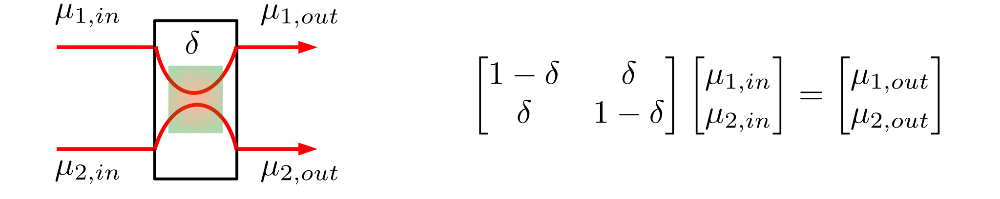
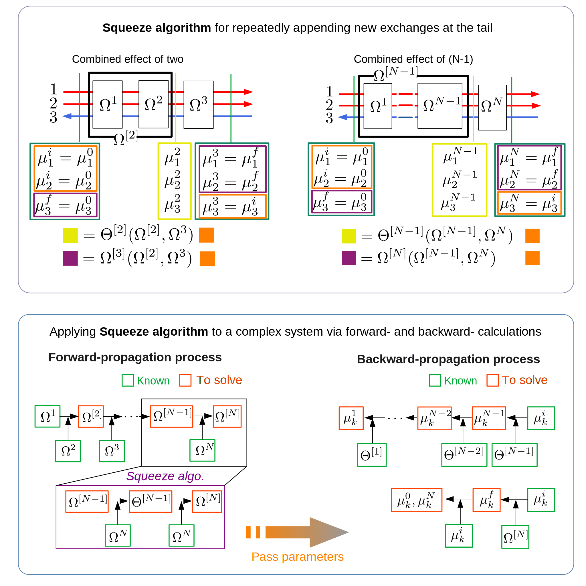

# CounterFusion


This repository implements algorithms for a paper in preparation. I would like to provide an introduction to the modelling and algorithm development here. More details can be found in [my personal website](http://lixianphwang.com/projects/1_project/).

## Introduction to Modelling and Algorithms
#### Modelling and linear algebra analysis
The building block is a single exchange that mixes the quantity ($\mu_{1,in},\mu_{2,in}$) representing for each channel to some extent $\delta$. Here $\delta=0.5$  stands for a full mixing, while $\delta=0$ stands for no mixing at all. The effect of this exchange is characterized by the difference between $\mu_{in}$ and $\mu_{out}$, i.e., the matrix equation on the right side. A chain of exchange can also be described by a corresponding matrix equation, but in a more complicated form, as long as the number of channels does not exceed two.
a). A single exchange
 
b). Multiple exchanges

Unfortunately, when dealing with more channels, no more convenient analytical expression can be used for a system comprising many exchanges. We have to perform this analysis by adding the exchange one by one, which is clearly demanding the development of an algorithm to automate this calculation.
c). For more than two channels, there are no more convinient matrix equation as above.

#### Algorithm development
When multiple (more than two) channels propagate in opposite directions, the overall effect of exchange becomes rather challenging to estimate via conventional methods. To address this challenge, I have developed an algorithm, called the **Squeeze algorithm**, to calculate for two consecutive exchanges  and extend this to an arbitrary number of exchanges , then extending to for arbitrary number of exchanges .  
The fundamental concept is to initially link the initial states (orange) with the intermediate states (yellow), and then further develop the relationship between the initial and final states (purple) through this pre-calculated connection.
In a large system comprising N exchanges, the Squeeze algorithm will be repeatedly invoked by high-level algorithms to solve all necessary parameters connecting intermediate states at each level (length of the chain) in a forward-propagation process. These parameters will then be passed to a later backward-propagation process to obtain all final states at each level.


## Installation
PyPI
```bash
python -m venv env
source env/bin/activate
pip install counterfusion==0.1.1
```

Git clone 
```bash
git clone git@github.com:LarsonLaugh/Counterfusion.git
cd Counterfusion
python -m venv env
source env/bin/activate
pip install -r requirements.txt
```

## Usage

For details, please refer to the [jupyter notebook](demo.ipynb) which provides many demo cases. Here you may find python
snippets to showcase step-by-step the build-up from the bottom, a single exchange, to a system containing multiple sequences of
exchanges.

1. Define a single exchange

```python
from counterfusion import interaction_builder
left_stochastic_matrix = interaction_builder(dim=2,id1=0,id2=1,value=[0.1,0.3])
right_stochastic_matrix = left_stochastsic_matrix.T
doubly_stochastic_matrix = interaction_builder(dim=2,id1=0,id2=1,value=0.5)
```

2. Define a sequence of exchanges

```python
from counterfusion import *
#===============================================================
# General information for the edge - Hyperparameters
totalNumMover = 4
numForwardMover = 2
initStates = [1,1,0.2,0.2]
#===============================================================
# Information of scattering events 
# exchange parameters
v03 = 0.3
v01 = 0.5
v23 = 0.8
edgeDef = [[0,3,v03,10],[0,1,v01,10],[2,3,v23,10]]
edgeInfo = generate_bynumber(edgeDef)
edge = Edge(edgeInfo,totalNumMover,numForwardMover)
```
3. Define a system constituted by several Edge instances.

```python
from counterfusion import *
# Define a six-terminal system
# C1--M1--C2--M2--C3--M3--C4--M4--C5--M5--C6--M6--C1
# Total number of edge states: 4
# Number of forward-moving edge states: 2 (#0,#1)
# Number of backward-moving edge states: 2 (#2,#3)
#===============================================================
# General information for the system - Hyperparameters
totalNumMover = 4
numForwardMover = 2
zeroVoltTerminal = 3
#===============================================================
# Information of scattering events 
# exchange parameters
v02 = 0.9
v13 = 0.7
v12 = 0.3
# Define exchange between nodes (contacts)
# C1--M1--C2
edgeDef1 = [[0,2,v02,10],[1,3,v13,10]]
# C2--M2--C3
edgeDef2 = [[0,2,v02,10],[1,2,v12,10]]
# C3--M3--C4
edgeDef3 = [[0,2,v02,10],[1,3,v13,10]]
# C4--M4--C5
edgeDef4 = [[0,2,v02,10],[1,2,v12,10]]
# C5--M5--C6
edgeDef5 = [[0,2,v02,10],[1,3,v13,10]]
# C6--M6--C1
edgeDef6 = [[0,2,v02,10],[1,2,v12,10]]
#================================================================
edgesDef = [edgeDef1,edgeDef2,edgeDef3,edgeDef4,edgeDef5,edgeDef6]
edgesInfo = []
for edgeDef in edgesDef:
    edgesInfo.append(generate_bynumber(edgeDef))
graph = []
for edgeInfo in edgesInfo:
    graph.append(Edge(edgeInfo,totalNumMover,numForwardMover))
nodesCurrent = [1,0,0,-1,0,0]
sys = System(nodesCurrent,graph,numForwardMover,zeroVoltTerminal)
```

4. Define individual paths of flows

```python
# The definition of blocking_state should strictly follow this rule: 
# [[index_of_terminal#1,[all blocked states in this terminal]],[[index_of_terminal#2,[all blocked states in this terminal],...]]]
blockStates = [[1,[0]],[0,[2]],[2,[3]],[3,[1]]]
sys = System(nodesCurrent,graph,numForwardMover,zeroVoltTerminal,blockStates)
```
